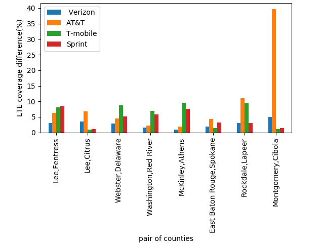

# Network Equity Project
<link rel="stylesheet" type="text/css" media="all" href="main_css.css" />

### 1. Project Description:
The quality of internet access straddles the domains of regulation
and market forces. Most users have a choice between cable, DSL, and cellular access. However, it is not
clear that whether US residents have equal access to the internet or equal access for the price. Without
a standard for internet quality, it is also not clear whether people from different communities have equal
internet accessibility. The objective of this project is to know that internet access available to different communities meets
their needs to participate in modern educational opportunities for example doing online academic class
and commercial opportunities for example online business, online meeting etc.

Our goal is to characterize the equality of internet access in the US. Equality of access must be understood
along the dimension of service availability, performance and cost as well as the types of application services
and their quality that a given performance level enables. If we consider internet access as a right, equality
must also be understood in terms of fairness across different communities.

To have a better understanding of the equality of internet access, we propose to measure and collect
data on service availability, performance and cost in different US communities broken down by counties.
Particularly, we want to discover whether there is any significant variation in the ability of community
residents to participate in education and commercial opportunities provided by different applications.
To do so, we compare the internet performance with the quality of experience metrics for different
services and price. We also want to understand the factors that cause variation in internet performance or
price. For example, while rural communities may suffer poor internet performance due to distant peering
points, greater congestion in urban area can also affect the internet performance for the urban residents.
Finally, we want to understand whether there are community factors other than geographic location
correlated with internet performance, for example, race, income, education levels within a community.

This project will show a view of internet access as a right and demonstrate the parameters that cause any
inequality. This observation might inform regulation that provides equitable access to internet services
and by extension equitable access to educational and commercial opportunities available on the internet.

### 2. Technical Approach:
The main idea is to correlate Network Performance Data with US census data. 

__*US Census Data:*__
The census data is collected from [American Community Survey website](
https://www.census.gov/library/publications/2011/compendia/usa-counties-2011.html) 
Data we get from US Census are:
- Population
- Income(median income)
- Education(number of people with Bachelor degree)
- Race (percentage of white people)
broken down by county. We have also got the location of each county so that we can correlate network measurement point data.

__*Network Measurement Data:*__
- Uplink bandwidth
- Downlink bandwidth
- Signal strength
- Carrier (Verizon, ATT, T-mobile, Sprint)
- Network technology (LTE, 2G/3G)
- Location of measurement (latitude, longitude from each county)

#### 2.1 Normalization and Similarity measure:

We normalized the census data and then computed all pair-wise similarity between the counties. We
converted all the variables of each county i.e. population, income, education, race into a specific range
using min-max normalization. For race data, we have considered percentage of white people in each
county. Figure 1 is the 3D plotting of the normalized data of population, income and education for all
the counties in US. For convenience of the reader we have added 2D views of each side of the 3D plot which are depicted in Figure 2,3,4.

Then we calculated Euclidean distance of each pair of counties to measure similarity of the counties.
Our goal is to find out the pair of counties which are most similar in terms of population, income and
education but different in terms of race. 
Suppose m denotes the Euclidean distance of county A and B for population, income,
education and n denotes the Euclidean distance of county A and B for race. Then we compute a ratio r
which is defined as follows:
r = m/n

We compute this ratio for all pairs of counties and find the counties which have the smallest ratio values.
There are 3137 number of counties in US and we found all possible pair of counties in US and the number
of all possible pair of counties is 4915680. We computed ratio for these pair of counties and by sorting, we
get the pair of counties which have the smallest ratio values. As plotting ratio values of all the 4915680
pair of counties will not be readable, we worked on first 8 pairs of counties. Figure 5, 6 and 7 illustrates normalized data of population vs education, population vs income and education vs income for 8 pairs of counties respectively.

Finally the pairs of counties we worked on are:
(Lee, SC, Fentress, TN), (Lee, AL, Citrus, FL), (Webster, LA, Delaware, OK), (Washington, NC, Red
River, TX), (McKinley, NM, Athens, OH), (East Baton Rouge, LA, Spokane, WA), (Rockdale, GA,
Lapeer, MI), (Montgomery, KY, Cibola, NM)

  

 

  

#### 2.2 Correlation
From network performance data, we computed percentage of LTE and 2G/3G coverage for different
carriers and average signal strength of LTE and 2G/3G provided by different carriers in each county.
Also we computed difference in the percentage of LTE coverage and 2G/3G coverage for the pairs of
counties, which is depicted in figure 9 and 10 respectively. We found correlation between network
data and race data for the pairs of counties. For example, in Fentress, TN county percentage of LTE
coverage by Verizon is 31.69058% and percentage of white people is 97.824%. For Lee, SC county
percentage of LTE coverage by Verizon is 28.62985% and percentage of white people is 33.1937%. We
calculated correlation between Lee, SC and Fentress, TN, similarly
we did the calculation for all the 8 pairs of counties.

 

